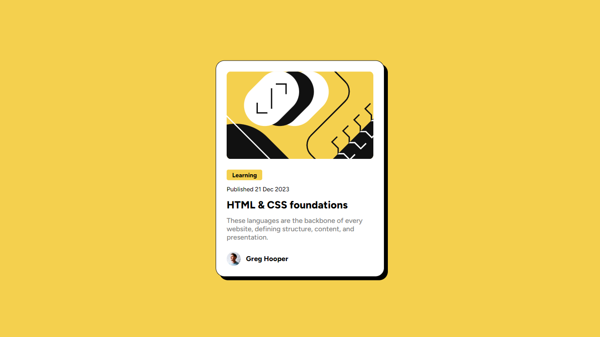

# Frontend Mentor - Blog preview card solution

This is a solution to the [Blog preview card challenge on Frontend Mentor](https://www.frontendmentor.io/challenges/blog-preview-card-ckPaj01IcS). Frontend Mentor challenges help you improve your coding skills by building realistic projects.

## Table of contents

- [Overview](#overview)
    - [The challenge](#the-challenge)
    - [Screenshot](#screenshot)
    - [Links](#links)
- [My process](#my-process)
    - [Built with](#built-with)
    - [Useful resources](#useful-resources)
- [Author](#author)

## Overview

### The challenge

Users should be able to:

- See hover and focus states for all interactive elements on the page

### Screenshot

### Links

- Live Site URL : [Blog preview card](https://laminegithub.github.io/blog-preview-card/)
- Solution URL : [Code Solution](https://github.com/LamineGitHub/blog-preview-card)

## My process

### Built with

- Semantic HTML5 markup
- CSS custom properties
- Flexbox

### Useful resources

- [Clamp Calculator](https://www.marcbacon.com/tools/clamp-calculator/) - This website was very helpful for calculating
  the amount of clamps needed for my project. I particularly appreciated this handy tool and will use it in the future
  for my woodworking projects.

## Author

- LinkedIn - [Lamine Diallo](https://www.linkedin.com/in/mamadou-lamine-diallo-1a8596241)
- Frontend Mentor - [@lamine](https://www.frontendmentor.io/profile/LamineGitHub)
